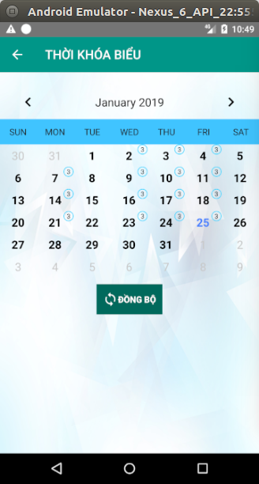

<p align="center">
  <!-- Logo -->
  
</p>

<p align="center">
  <a href="https://www.paypal.me/KenHoangDev">
    
  </a>
</p>

## Introduction

[fg-timetable](https://github.com/KenHoang16CDTH12/FG-TimeTable-HueIC) is a app time table .

- [Donate](https://www.paypal.me/KenHoangDev)

## Preparation

You need to install [Android Studio](https://developer.android.com/studio/) and [git](https://git-scm.com/) locally. Understanding and learning this knowledge in advance will greatly help the use of this project.

---

## Screenshots APP

<p align="center">
             
</p>

## Setup

```bash
# clone the project
git clone https://github.com/KenHoang16CDTH12/FG-TimeTable-HueIC.git

import project in Android Studio
```

## Donate

If you find this project useful, you can buy author a glass of juice :tropical_drink:

[Paypal Me](https://www.paypal.me/KenHoangDev)

## License

[MIT](#)

Copyright (c) 2018-present FGDev
